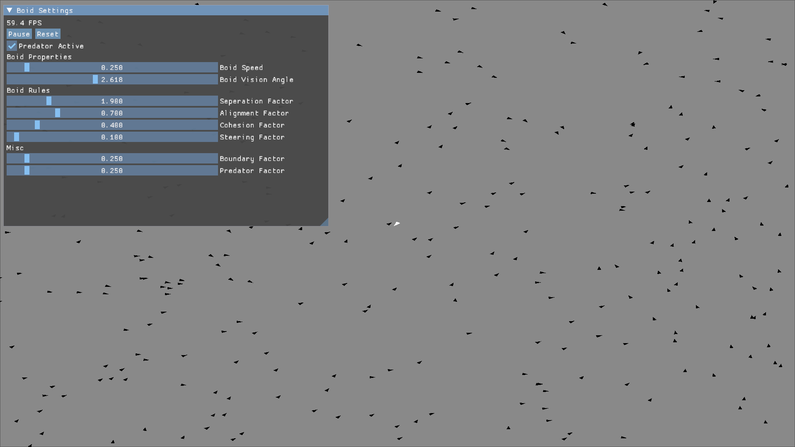

# BPM (Boids Predator Model)
BPM, also known as the Boids Predator Model, aims to serve as a re-implementation of the Boids Behaviour Model established by Craig Reynolds in 1987. It utilises DBscan clustering to allow an incoming predator (modelled after the peregrine falcon) to identify and chase the largest cluster of boids. This project builds upon the base code from the COMP3811 Module from the University of Leeds.
# Installation
The project has currently only been tested on Linux. To install this project first clone the repository:
```bash
git clone git@github.com:pithnoo/Boids-Predator-Model.git
```
Then compile and run the program in its release build:
```bash
make -j6 config=release_x64
./bin/bpm-release-x64-gcc.exe
```
# Usage

<br><br>
`Reset`: reset all entities to their original position<br><br>
`Pause`: pause the simulation<br><br>
`Predator Active`: toggle to instantiate the predator in the environment<br><br>
`Boid Speed`: adjust the overall movement speed of the boid population<br><br>
`Boid Vision Angle`: the range at which a boid can detect other neighbours<br><br>
`Seperation Factor`: the force repelling each boid away from each other<br><br>
`Alignment Factor`:  the force which steers all boids in the same direction overall<br><br>
`Cohesion Factor`:  the force steering all boids to the center of a local flock<br><br>
`Steering Factor`:  the influence that the Seperation, Alignment, and Cohesion Factor have on the boid's overall direction<br><br>
`Boundary Factor`:  the force steering the boids away from the bounds of the window<br><br>
`Predator Factor`: the force repelling the boids away from the predator<br><br>

# Known Issues
In the case where there are issues with running the program due to deprecation, remove the generated build file and recompile:
```bash
rm -r _build_/
make -j6 config=release_x64
```
